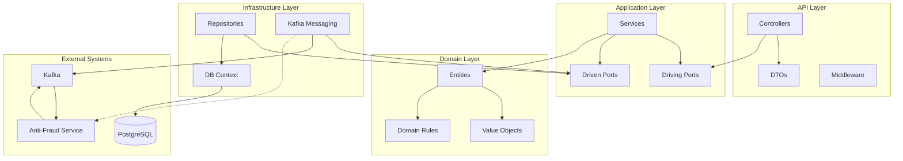
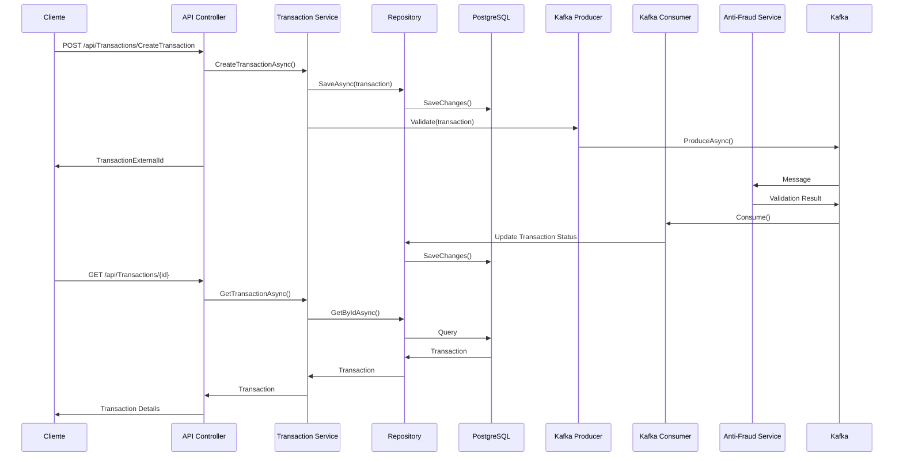

# BcpYapeBo Transaction API

## Descripción

API que maneja las transacciones de Yape Bolivia, permitiendo la creación y consulta de transacciones bancarias con integración a un servicio de anti-fraude a través de Kafka.

## Arquitectura

La aplicación sigue una arquitectura hexagonal (ports and adapters) para aislar el dominio de negocio de las preocupaciones externas.



### Flujo de Transacción



## Características

- Arquitectura hexagonal (puertos y adaptadores) para separar la lógica de negocio de la infraestructura
- Integración con PostgreSQL para almacenamiento persistente de las transacciones
- Sistema de mensajería asíncrona con Kafka para validación anti-fraude
- Documentación automática con Swagger
- Logging con Serilog
- Manejo centralizado de excepciones

## Requisitos Previos

- .NET 6 o superior
- PostgreSQL
- Kafka

## Configuración

La aplicación utiliza un archivo `appsettings.json` para su configuración. Se deben configurar:

- Cadena de conexión a PostgreSQL
- Configuración de Kafka
- Configuración de Serilog

Ejemplo de configuración:

```json
{
  "ConnectionStrings": {
    "DefaultConnection": "Host=localhost;Database=yapebo_transactions;Username=postgres;Password=your_password"
  },
  "Kafka": {
    "BootstrapServers": "localhost:9092",
    "TransactionAntiFraudServiceValidationTopic": "transaction-anti-fraud-service-validation"
  },
  "Serilog": {
    "MinimumLevel": {
      "Default": "Information",
      "Override": {
        "Microsoft": "Warning",
        "System": "Warning"
      }
    }
  }
}
```

## Estructura del Proyecto

El proyecto sigue una arquitectura hexagonal con las siguientes capas:

### API

Contiene los controladores y middleware para manejar las solicitudes HTTP.

- **Controllers/**: Endpoints para crear y consultar transacciones
- **DTOs/**: Objetos de transferencia de datos para la API
- **Common/**: Middleware para manejo de excepciones

### Aplicación

Contiene la lógica de negocio y orquestación de servicios.

- **Services/**: Implementación de los servicios de aplicación
- **Ports/**: 
  - **Driving/**: Puertos que permiten interactuar con la aplicación
  - **Driven/**: Puertos que la aplicación usa para comunicarse con servicios externos

### Dominio

Contiene las entidades del negocio, value objects y reglas de dominio.

- **Entities/**: Entidades principales como BankTransaction
- **ValueObjects/**: Objetos inmutables como AccountId y TransactionValue
- **Enums/**: Enumeraciones como TransactionStatus y TransactionType

### Value Objects

El proyecto utiliza Value Objects para encapsular y validar los valores del dominio:

#### AccountId

```csharp
namespace BcpYapeBo.Transaction.Domain.ValueObjects
{
    public record AccountId(Guid Value)
    {
        public static AccountId Create(Guid value)
        {
            if (value == Guid.Empty)
                throw new ArgumentException("El ID de cuenta no puede estar vacío");
            return new AccountId(value);
        }
    }
}
```

#### TransactionValue

```csharp
namespace BcpYapeBo.Transaction.Domain.ValueObjects
{
    public record TransactionValue(decimal Amount)
    {
        public static TransactionValue Create(decimal amount)
        {
            if (amount <= 0)
                throw new ArgumentException("El monto de la transacción debe ser positivo");
            return new TransactionValue(amount);
        }
    }
}
```

### Infraestructura

Contiene las implementaciones concretas de los puertos secundarios.

- **Repositories/**: Implementación de acceso a datos con Entity Framework Core
- **Messaging/**: Implementación de servicios de Kafka para anti-fraude
- **DTOs/**: Objetos de transferencia de datos para la comunicación con servicios externos

## Decisiones Críticas de Diseño

### 1. Arquitectura Hexagonal

**Decisión:** Implementar una arquitectura hexagonal (ports and adapters).

**Razones:**
- Separación clara entre la lógica de negocio y la infraestructura
- Facilita el testing al poder aislar el dominio
- Permite cambiar componentes de infraestructura (como la base de datos o mensajería) sin afectar al dominio
- Mejora la mantenibilidad al tener responsabilidades bien definidas

**Consecuencias:**
- Mayor complejidad inicial en la estructura del proyecto
- Requiere disciplina para mantener la separación de capas

### 2. Value Objects Inmutables

**Decisión:** Usar Records de C# para los Value Objects del dominio.

**Razones:**
- Proporciona inmutabilidad por defecto
- Implementación automática de comparación basada en valores
- Validación centralizada de reglas de negocio
- Previene estados inválidos

**Consecuencias:**
- Cualquier cambio en un value object requiere crear una nueva instancia

### 3. Procesamiento Asíncrono con Kafka

**Decisión:** Utilizar Kafka con configuración de alta confiabilidad (Acks.All) para la validación anti-fraude.

**Razones:**
- Desacopla el flujo principal de transacciones de la validación anti-fraude
- Permite escalar cada componente independientemente
- Garantiza que ninguna transacción se pierda incluso si hay fallos en brokers
- Mejora el rendimiento de la API al no bloquear la respuesta esperando validación

**Consecuencias:**
- Eventual consistencia en el estado de las transacciones
- Mayor complejidad operativa al gestionar Kafka
- Necesidad de manejar escenarios de fallos en la comunicación

### 4. BackgroundService para Consumo de Kafka

**Decisión:** Implementar el consumidor de Kafka como un BackgroundService.

**Razones:**
- Procesamiento continuo independiente del ciclo de vida de las solicitudes HTTP
- Gestión automática del ciclo de vida por el contenedor de DI de .NET
- Graceful shutdown cuando la aplicación se detiene
- Uso eficiente de recursos al utilizar TaskCreationOptions.LongRunning

**Consecuencias:**
- Requiere consideraciones especiales para el manejo de errores
- Necesita monitoreo específico al ejecutarse en segundo plano

## Endpoints

### POST /api/Transactions/CreateTransaction

Crea una nueva transacción bancaria.

**Request:**
```json
{
  "sourceAccountId": "guid",
  "targetAccountId": "guid",
  "transferTypeId": 1,
  "value": 100.50
}
```

**Response (200 OK):**
```json
{
  "transactionExternalId": "guid"
}
```

### GET /api/Transactions/{transactionExternalId}

Obtiene los detalles de una transacción específica.

**Response (200 OK):**
```json
{
  "transactionExternalId": "guid",
  "createdAt": "2023-01-01T12:00:00Z"
}
```

## Flujo de Transacción

1. El cliente envía una solicitud para crear una transacción.
2. El sistema valida los datos de entrada y reglas de negocio.
3. La transacción se guarda en la base de datos con estado "Pendiente".
4. La transacción se envía al servicio anti-fraude a través de Kafka.
5. El servicio anti-fraude procesa la transacción y devuelve un resultado.
6. Un consumidor de Kafka escucha los resultados y actualiza el estado de la transacción.

## Integración con Kafka

### Productor (TransactionAntiFraudServiceKafka)

- Utiliza `Acks.All` para garantizar que todos los brokers confirmen la recepción del mensaje, lo que proporciona la máxima confiabilidad en la entrega de mensajes críticos de transacciones.
- Esto asegura que una transacción no se pierda incluso si ocurre un fallo en algún broker de Kafka.

```csharp
var producerConfig = new ProducerConfig
{
    BootstrapServers = configuration["Kafka:BootstrapServers"],
    Acks = Acks.All 
};
```

### Consumidor (TransactionAntiFraudStatusConsumerKafka)

- Implementado como un `BackgroundService` para garantizar un procesamiento continuo de mensajes independiente del ciclo de vida de las solicitudes HTTP.
- El uso de `BackgroundService` permite que el consumidor de Kafka se ejecute de manera independiente al flujo principal de la aplicación, optimizando recursos.
- Se utiliza `TaskCreationOptions.LongRunning` en `Task.Factory.StartNew()` para indicar al sistema que esta tarea es de larga duración y debe ser tratada de manera especial por el planificador de tareas:

```csharp
await Task.Factory.StartNew(() => ConsumerLoop(stoppingToken), TaskCreationOptions.LongRunning);
```

- Esta configuración es ideal para operaciones continuas como la escucha de mensajes Kafka, ya que:
  - Evita el uso del pool de threads estándar para tareas que no terminarán pronto
  - Optimiza el rendimiento al asignar un thread dedicado
  - Permite una mejor gestión de recursos del sistema

## Ejecución

Para ejecutar la aplicación:

```
dotnet run --project BcpYapeBo.Transaction.API
```

La API estará disponible en `https://localhost:5001` y Swagger en la raíz de la aplicación.

## Desarrollo

### Agregar Nuevos Tipos de Transacciones

Para agregar nuevos tipos de transacciones, actualice el enum `TransactionType` en el dominio.

### Modificar Reglas de Validación

Las reglas de validación de dominio se encuentran en la entidad `BankTransaction` y en los value objects.

## Monitoreo y Operación

### Métricas Recomendadas

- Tasa de transacciones por segundo
- Latencia promedio de procesamiento
- Tasa de transacciones rechazadas por anti-fraude
- Tamaño de la cola de Kafka
- Retrasos en el consumo de mensajes

### Registros (Logs)

La aplicación utiliza Serilog para un registro estructurado, facilitando:
- Seguimiento de transacciones a través del sistema
- Identificación de problemas en la integración con Kafka
- Monitoreo de rendimiento
- Alertas en errores críticos

## Licencia

Propiedad de BCP Yape Bolivia.
